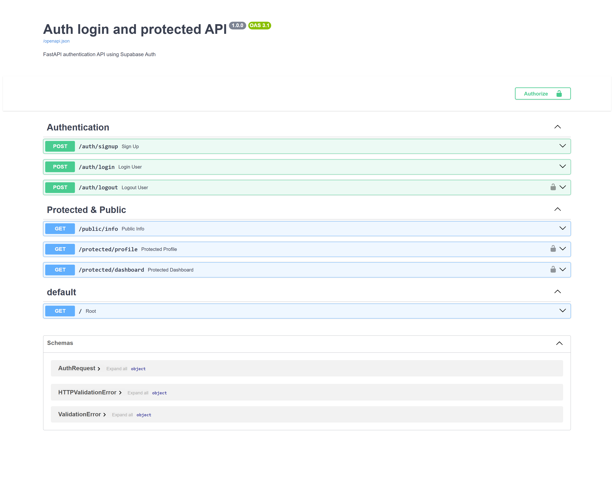
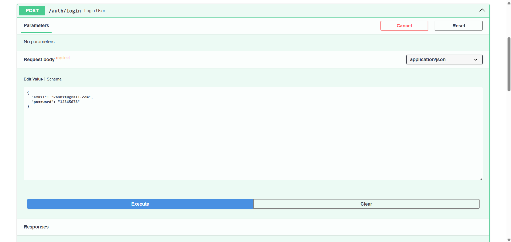
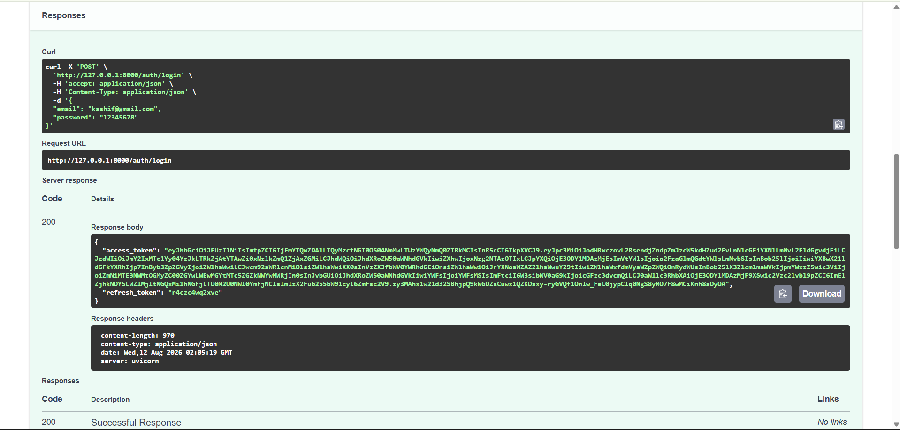
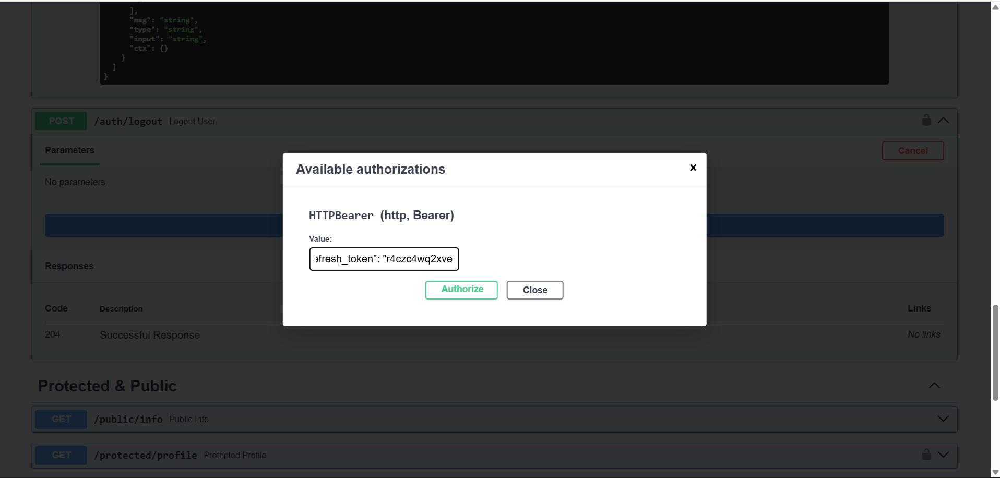
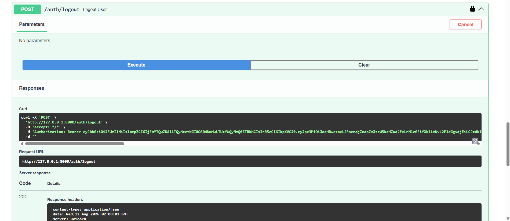
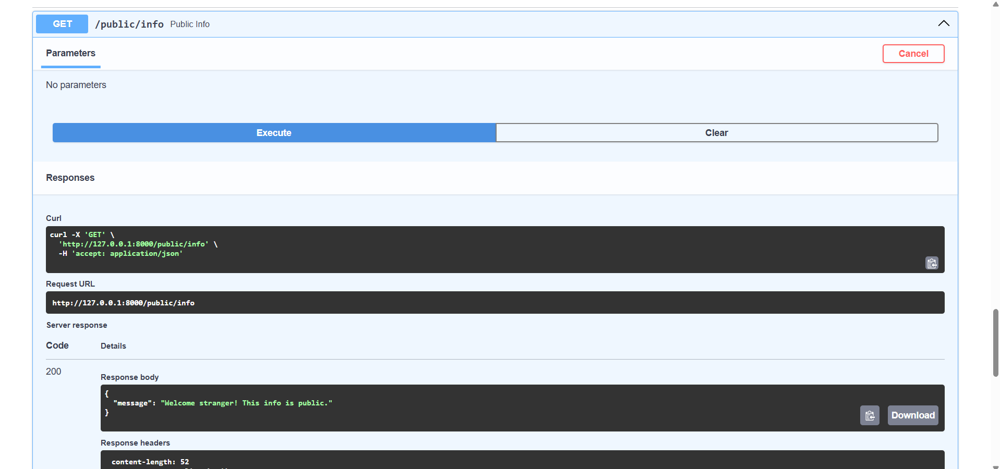
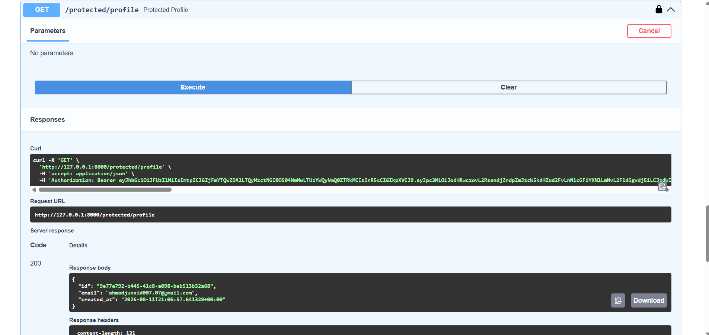

# Auth Login & Protect API

A secure authentication API built with **FastAPI** and **Supabase Auth**. This project demonstrates user signup, login, JWT-based authentication, protected routes, reusable authentication dependencies, logout, and Swagger UI documentation.

## 🚀 Features

- User Sign Up with Supabase Auth
- User Login with email and password
- JWT Access Token authentication
- Protected API endpoints
- Reusable FastAPI authentication dependency
- User profile endpoint
- Protected dashboard endpoint
- User logout
- Public API endpoint
- Swagger UI with Bearer Token authentication
- Environment variables for secure configuration
- Git/GitHub version control

---

## 🛠️ Technologies Used

- **Python 3.10+**
- **FastAPI**
- **Supabase Auth**
- **Pydantic**
- **Uvicorn**
- **Python-dotenv**
- **Git & GitHub**
- **Swagger UI / OpenAPI**

---

## 📁 Project Structure

```text
A4_Auth_Login_Protect/
│
├── routers/
│   ├── __init__.py
│   ├── auth.py
│   └── protected.py
│
├── database.py
├── dependencies.py
├── main.py
├── .env
├── .gitignore
├── requirements.txt
└── README.md
```

.env is not included in the repository because it contains private configuration values.

## ⚙️ Setup

**1. Clone the repository**

```
git clone <YOUR_GITHUB_REPOSITORY_URL>
cd A4_Auth_Login_Protect
```

**2. Create a virtual environment**

```
python -m venv venv
```

Activate it on Windows:

```
venv\Scripts\activate
```

**3. Install dependencies**

```
pip install -r requirements.txt
```

**4. Configure Supabase**

Create a project in Supabase and obtain your:

- Project URL
- Publishable/Anon Key

Create a .env file in the project root:

```
SUPABASE_URL=your_supabase_project_url
SUPABASE_KEY=your_supabase_publishable_key
```

**Never commit your .env file or Supabase secrets to GitHub.**

## ▶️ Running the API

Start the FastAPI server with:

```
uvicorn main:app --reload
```

The API will be available at:

http://127.0.0.1:8000

Swagger UI:

http://127.0.0.1:8000/docs

## 🔐 Authentication Flow

The authentication flow uses Supabase as the Identity Provider.

```
Client
  │
  │ Sign Up / Login
  ▼
Supabase Auth
  │
  │ JWT Access Token
  ▼
Client
  │
  │ Authorization: Bearer <JWT>
  ▼
FastAPI Backend
  │
  │ Verify JWT with Supabase
  ▼
Protected Resource
```

## 📚 API Reference

| Method | Endpoint | Authentication | Description |
|---|---|---|---|
| POST | /auth/signup | ❌ No | Create a new user |
| POST | /auth/login | ❌ No | Login and receive JWT tokens |
| POST | /auth/logout | ✅ Yes | Logout authenticated user |
| GET | /public/info | ❌ No | Access public information |
| GET | /protected/profile | ✅ Yes | Get authenticated user's profile |
| GET | /protected/dashboard | ✅ Yes | Access protected dashboard |

### 1. Sign Up

**POST /auth/signup**

Creates a new user account using Supabase Auth.

**Request**

```json
{
  "email": "user@example.com",
  "password": "password123"
}
```

**Successful Response**

**Status:** 201 Created

```json
{
  "message": "User created successfully.",
  "user": {}
}
```

### 2. Login

**POST /auth/login**

Authenticates an existing user and returns an access token and refresh token.

**Request**

```json
{
  "email": "user@example.com",
  "password": "password123"
}
```

**Successful Response**

**Status:** 200 OK

```json
{
  "access_token": "<JWT>",
  "refresh_token": "<REFRESH_TOKEN>"
}
```

The access_token is used to access protected endpoints.

### 3. Public Information

**GET /public/info**

This endpoint does not require authentication.

**Successful Response**

**Status:** 200 OK

```json
{
  "message": "Welcome stranger! This info is public."
}
```

### 4. Protected Profile

**GET /protected/profile**

This endpoint requires a valid Supabase JWT.

**Authorization Header**

```
Authorization: Bearer <ACCESS_TOKEN>
```

**Successful Response**

**Status:** 200 OK

```json
{
  "id": "user-id",
  "email": "user@example.com",
  "created_at": "account-creation-date"
}
```

**Without Authentication**

**Status:** 401 Unauthorized

```json
{
  "detail": "Not authenticated"
}
```

### 5. Protected Dashboard

**GET /protected/dashboard**

This endpoint is protected using the reusable authentication dependency.

A valid JWT must be supplied in the Authorization header.

```
Authorization: Bearer <ACCESS_TOKEN>
```

### 6. Logout

**POST /auth/logout**

Logs out the authenticated user.

**Authorization Header**

```
Authorization: Bearer <ACCESS_TOKEN>
```

**Successful Response**

**Status:** 204 No Content

## 🛡️ Authentication & Security

Authentication is handled using **Supabase Auth**.

The API uses FastAPI's HTTPBearer security scheme to extract the JWT from the request:

```
Authorization: Bearer <token>
```

The token is then verified with Supabase before protected endpoints are executed.

The authentication logic is implemented as a reusable FastAPI dependency, allowing multiple protected endpoints to share the same security mechanism.

Invalid, expired, or missing tokens result in:

```
401 Unauthorized
```

## 📖 Swagger UI

FastAPI automatically provides interactive API documentation through Swagger UI.

Open:

http://127.0.0.1:8000/docs

The protected endpoints use Bearer Token authentication and can be tested directly through Swagger's **Authorize** button.

**Swagger Screenshot**



### 1. Signup Endpoint


### 2. Login Endpoint



### 3. Login Endpoint



### 4. Public Info Endpoint


### 5. Protected Profile Endpoint


### 6. Protected Dashboard Endpoint


## 🔒 Environment Variables

The following variables are required:

```
SUPABASE_URL=your_supabase_project_url
SUPABASE_KEY=your_supabase_publishable_key
```

The .env file is excluded from Git using .gitignore.

Example:

```
.env
venv/
__pycache__/
*.pyc
```

## 🧪 Testing

The API can be tested using:

- Swagger UI
- cURL
- FastAPI interactive documentation

Example protected request:

```
curl -i -H "Authorization: Bearer <ACCESS_TOKEN>" http://127.0.0.1:8000/protected/profile
```

A valid token should return:

```
HTTP/1.1 200 OK
```

An invalid or expired token should return:

```
HTTP/1.1 401 Unauthorized
```

## 📌 HTTP Status Codes

| Status Code | Meaning | Usage |
|---|---|---|
| 200 | OK | Successful login/read |
| 201 | Created | Successful signup |
| 204 | No Content | Successful logout |
| 400 | Bad Request | Missing/invalid input |
| 401 | Unauthorized | Missing, invalid, or expired token |

## 📦 Requirements

The project dependencies can be installed using:

```
pip install -r requirements.txt
```

Generate the requirements file if needed:

```
pip freeze > requirements.txt
```

## 🎯 Assignment Objectives Completed

- Supabase Auth configured
- Signup endpoint implemented
- Login endpoint implemented
- JWT access token authentication
- Public endpoint implemented
- Protected profile endpoint implemented
- Protected dashboard endpoint implemented
- Token verification implemented
- Reusable authentication dependency implemented
- Logout endpoint implemented
- Swagger UI configured with Bearer authentication
- .env used for sensitive configuration
- .gitignore configured to protect secrets
- Git commits created for each assignment stage

## 👨‍💻 Author

**Ahmad Junaid**

BS Software Engineering
COMSATS University Islamabad, Lahore Campus