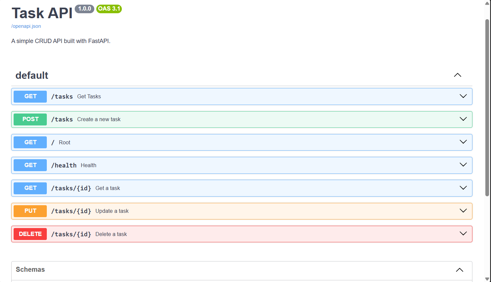
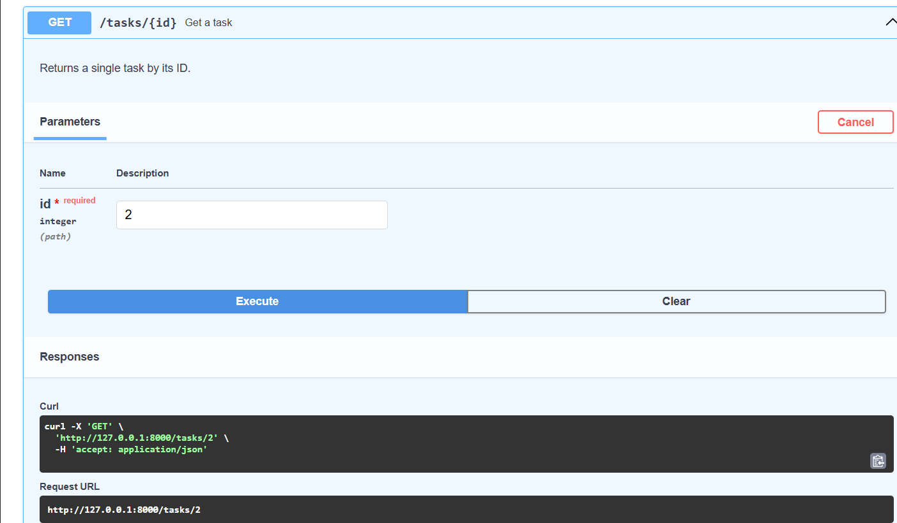
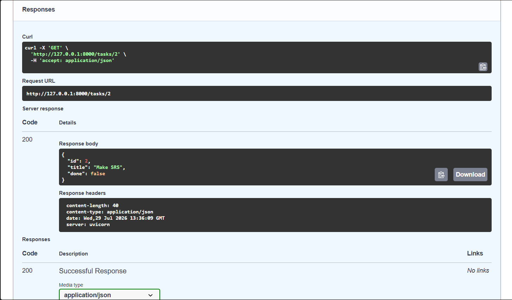
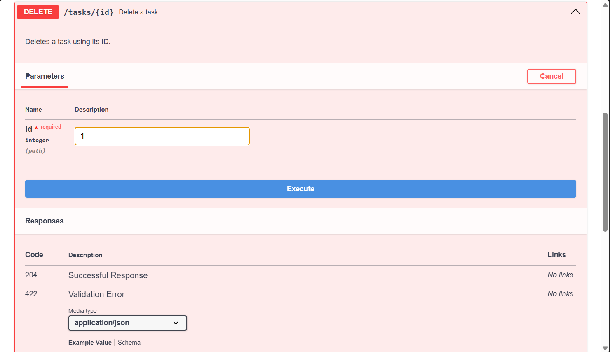
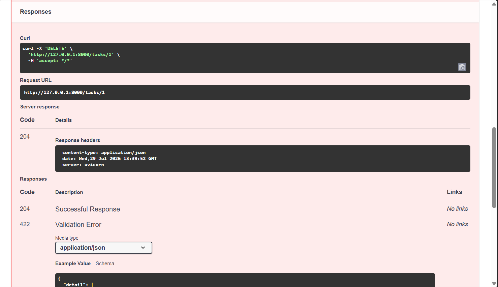
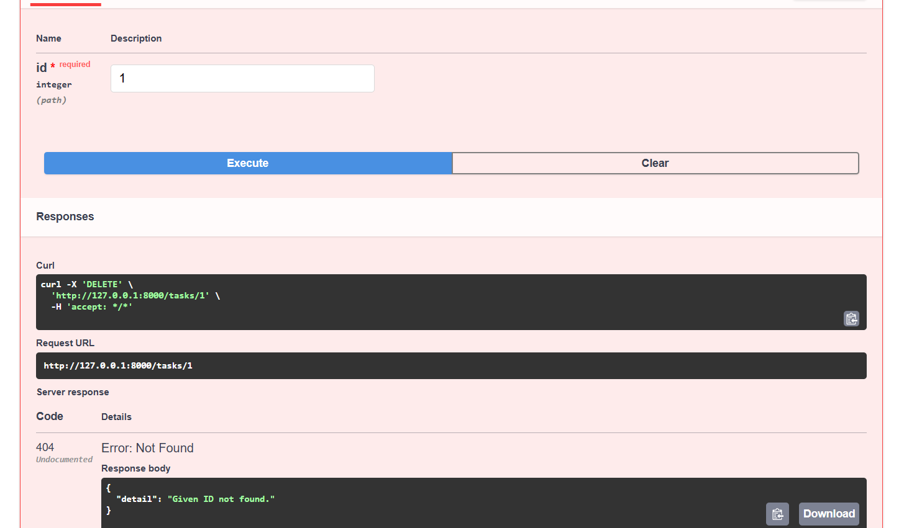

# FastAPI CRUD API

Backend AI Engineering - Assignment 1

A simple CRUD API built with FastAPI.

## Screenshots

### Swagger UI

All API endpoints generated automatically by FastAPI.

---

### Create Task (POST)

Creating a new task using Swagger UI.

---

### Retrieve Tasks (GET)

Listing all available tasks after creating a new one.

---

### Update Task (PUT)

Updating an existing task and marking it as completed.

---

### Delete Task (DELETE)

Deleting a task successfully.

---

### Verify Deletion (GET)

Confirming the task has been removed.

