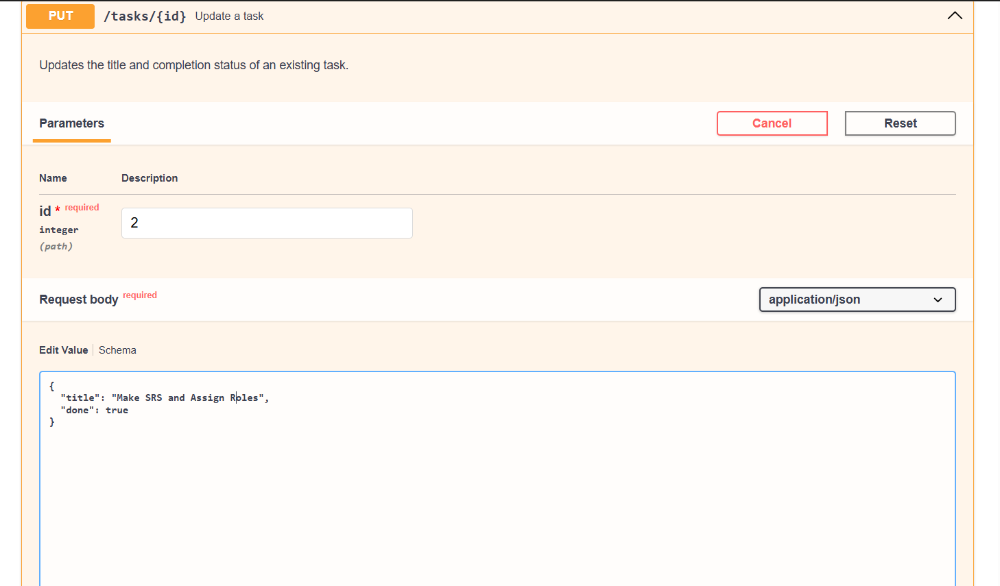
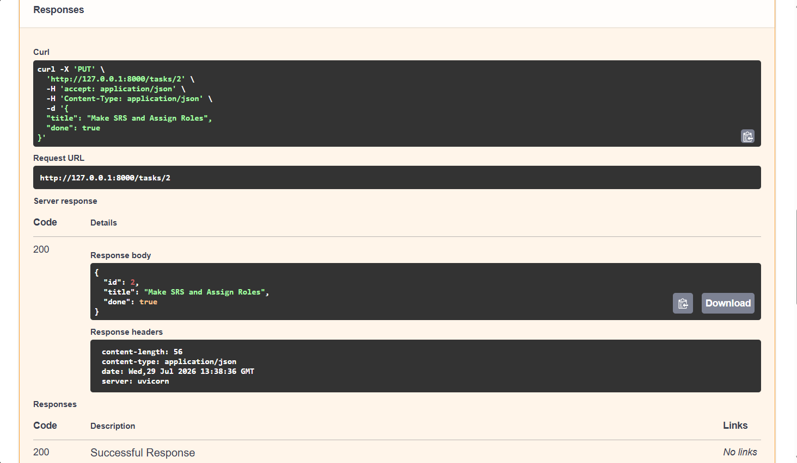
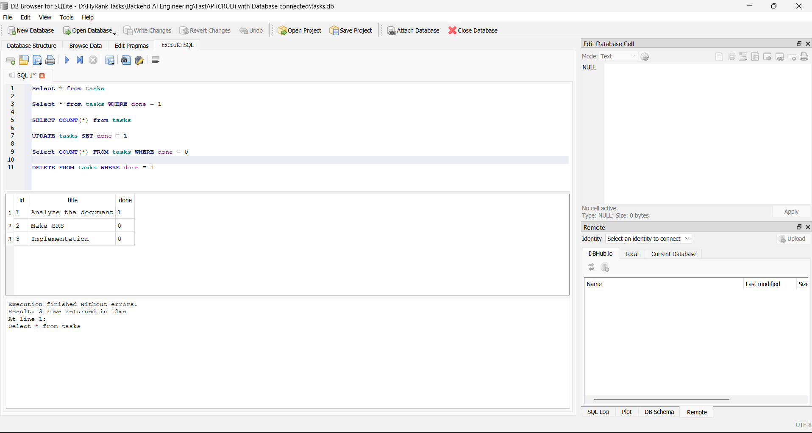

# FastAPI CRUD API with SQLite

Backend AI Engineering – Assignment 2

A simple **Task Management CRUD API** built with **FastAPI** and **SQLite**. This project extends the previous in-memory CRUD API by replacing the task list with persistent SQLite storage while keeping the same API endpoints and behaviour.

---

## Features

* Create a new task
* Retrieve all tasks
* Retrieve a task by ID
* Update an existing task
* Delete a task
* Request validation using Pydantic
* Custom exception handling
* Interactive API documentation with Swagger UI
* SQLite database persistence
* Automatic database and table creation
* Initial sample tasks inserted only when the database is empty
* Data survives server restarts

---

## Tech Stack

* Python 3
* FastAPI
* Pydantic
* Uvicorn
* SQLite
* Python `sqlite3` module

---

## Project Structure

```text
.
├── main.py
├── tasks.db
├── requirements.txt
├── README.md
├── .gitignore
└── Images/
```

---
---

## SQLite Database

This version uses SQLite instead of an in-memory Python list.

SQLite was chosen because it is lightweight, requires no separate database server, and stores the database in a single file.

The database file is:

```text
tasks.db

When the application starts:

The database is created if it does not exist.
The tasks table is created if it does not exist.
Three example tasks are inserted only if the table is empty.

The database schema is:
tasks
├── id      INTEGER PRIMARY KEY
├── title   TEXT
└── done    BOOLEAN

Because tasks are stored in SQLite, they survive server restarts.

---

### 7. API Endpoint table

Your existing table is mostly fine.

Just change:

```markdown
| GET    | `/tasks`      | Retrieve all tasks      |

to:
| GET    | `/tasks`      | Retrieve, search and filter tasks |
---

## Installation

Clone the repository:

```bash
git clone https://github.com/ajunaid05/Backend-AI-Engineering.git
cd Backend-AI-Engineering
cd "FastAPI(CRUD)"
```

Create a virtual environment:

```bash
python -m venv .venv
```

Activate the virtual environment.

**Windows**

```bash
.venv\Scripts\activate
```

**Linux / macOS**

```bash
source .venv/bin/activate
```

Install the dependencies:

```bash
pip install -r requirements.txt
```

---

## Run the API

Start the development server using:

```bash
uvicorn main:app --reload
```

The API will be available at:

```text
http://127.0.0.1:8000
```

---

## API Documentation

### Swagger UI

```
http://127.0.0.1:8000/docs
```

### ReDoc

```
http://127.0.0.1:8000/redoc
```

---

## API Endpoints

| Method | Endpoint      | Description             |
| ------ | ------------- | ----------------------- |
| GET    | `/`           | API information         |
| GET    | `/health`     | Health check            |
| GET    | `/tasks`      | Retrieve all tasks      |
| GET    | `/tasks/{id}` | Retrieve a task by ID   |
| POST   | `/tasks`      | Create a new task       |
| PUT    | `/tasks/{id}` | Update an existing task |
| DELETE | `/tasks/{id}` | Delete a task           |

---

## Example API Call

Create a new task using `curl`:

```bash
curl -i -X POST http://127.0.0.1:8000/tasks -H "Content-Type: application/json" -d "{\"title\":\"Buy milk\"}"
```

### Example Output

```http
HTTP/1.1 201 Created
date: Wed, 29 Jul 2026 13:57:55 GMT
server: uvicorn
content-length: 40
content-type: application/json

{"id":4,"title":"Buy milk","done":false}
```

---

## HTTP Status Codes

| Status Code         | Description                          |
| ------------------- | ------------------------------------ |
| **200 OK**          | Request completed successfully       |
| **201 Created**     | Resource created successfully        |
| **204 No Content**  | Resource deleted successfully        |
| **400 Bad Request** | Invalid request or validation failed |
| **404 Not Found**   | Requested task was not found         |

---

## SQL Queries Explored

The SQLite database was also explored using DB Browser for SQLite.

### Retrieve all tasks

```sql
SELECT * FROM tasks;

---

## Learning Outcomes

This project demonstrates:

* RESTful API development with FastAPI
* CRUD operations (Create, Read, Update, Delete)
* Request validation using Pydantic
* Exception handling using `HTTPException`
* Custom validation error handling
* Proper use of HTTP status codes
* Automatic API documentation with OpenAPI
* Interactive API testing using Swagger UI
* SQLite database integration
* SQL queries using Python `sqlite3` module
* Persistent data storage
* Database-backed CRUD operations

---


## Screenshots

### Swagger UI

All API endpoints generated automatically by FastAPI.


---

### Create Task (POST)

Creating a new task using Swagger UI.


---

### Retrieve Tasks (GET)

Listing all available tasks after creating a new one.


---

### Update Task (PUT)

Updating an existing task and marking it as completed.




---

### Delete Task (DELETE)

Deleting a task successfully.


---

### Verify Deletion (GET)

Confirming the task has been removed.


###DB Browser UI


## Example API Call

Create a new task using `curl`:

```bash
curl -i -X POST http://127.0.0.1:8000/tasks -H "Content-Type: application/json" -d "{\"title\":\"Buy milk\"}"
```

##curl -i Example with output

(venv) D:\FlyRank Tasks\Backend AI Engineering\FastAPI(CRUD)>curl -i -X POST http://127.0.0.1:8000/tasks -H "Content-Type: application/json" -d "{\"title\":\"Buy milk\"}"
HTTP/1.1 201 Created
date: Wed, 29 Jul 2026 13:57:55 GMT
server: uvicorn
content-length: 40
content-type: application/json

{"id":4,"title":"Buy milk","done":false}

## AI vs Me

### Prompt Used

(Paste your prompt here.)

### What the AI did better

- Organized the code into logical sections.
- Used helper functions to reduce duplicate code.
- Used FastAPI response models for better validation and Swagger documentation.
- Generated task IDs more safely using the maximum existing ID.

### What the AI got wrong

- Returned additional data from the `/reset` endpoint that was not requested.
- Added extra complexity through multiple response models and helper classes, which was unnecessary for this small assignment.

### What my prompt forgot

- Specify how task IDs should be generated after deletions.
- Specify that search should be case-insensitive.
- Define the exact response format for the reset endpoint.
- Specify the JSON structure for validation errors.

### Improved Prompt

After refining my prompt with more detailed requirements about response formats, ID generation, and validation behaviour, the regenerated code more closely matched the expected implementation.

## Author

**Ahmad Junaid**

Backend AI Engineering – Assignment 2

COMSATS University Islamabad